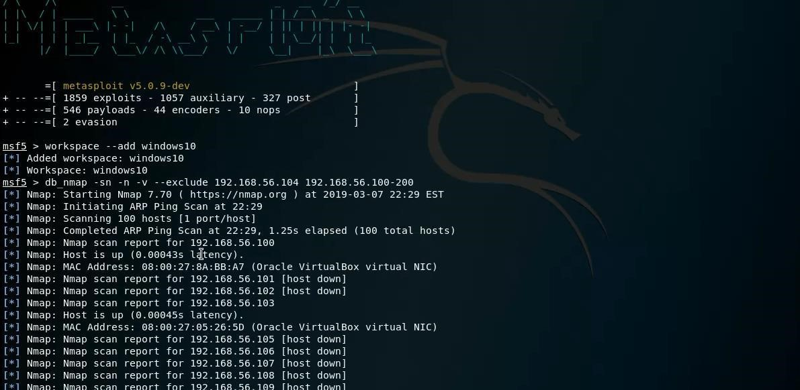
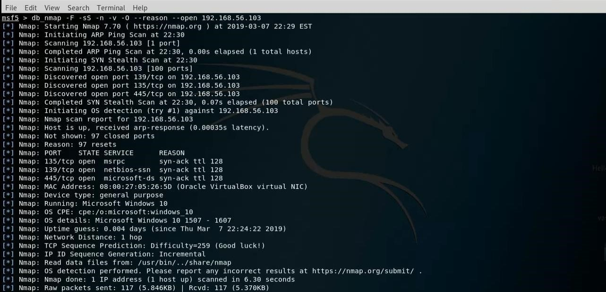
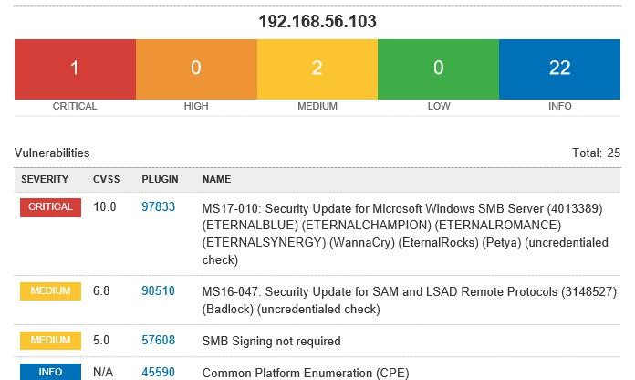
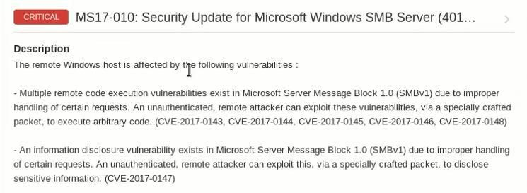
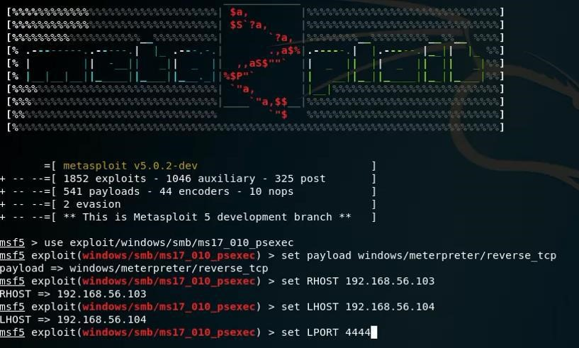
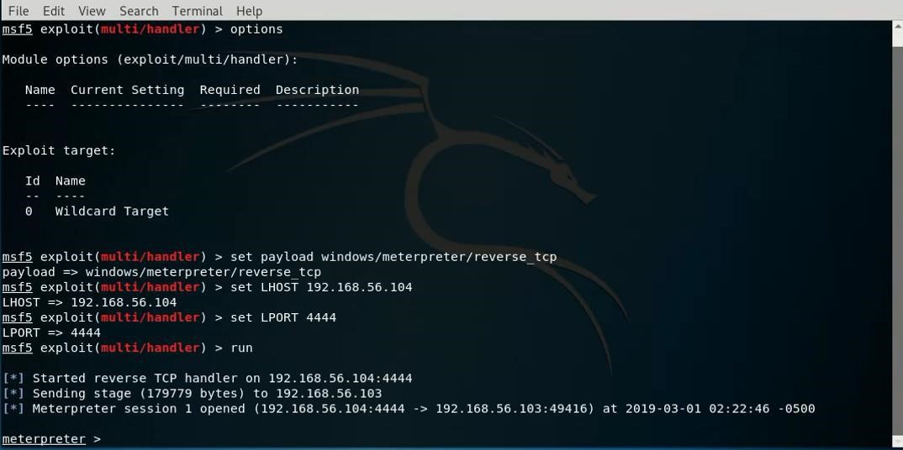
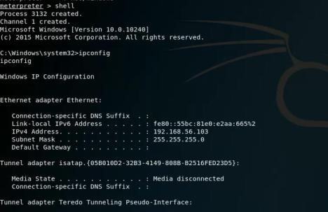
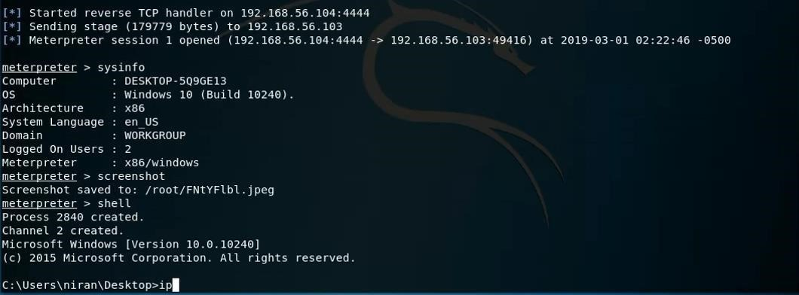
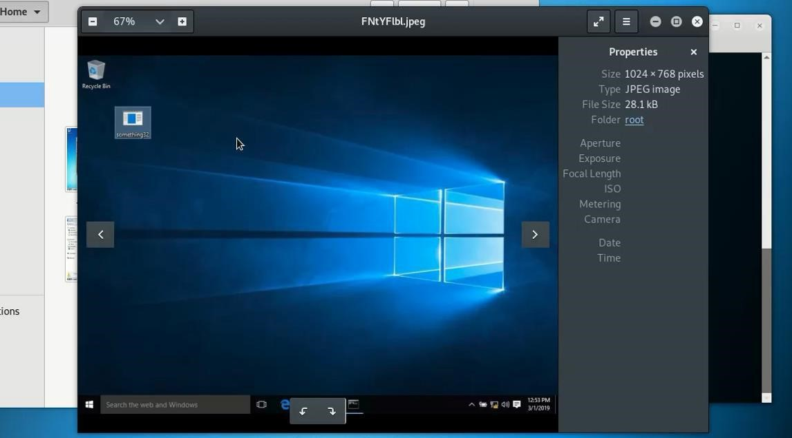

# **WINDOWS 10 PENETRATION TESTING REPORT**

##

## Introduction

Penetration testing session was conducted in order to determine Windows 10 systems exposure to a targeted attack. All activities were conducted in a manner that simulated a malicious actor engaged in a targeted attack against Windows 10 Operating System and both Victim (Windows

1. and Attacker (Kali 2019.1) were hosted on VirtualBox and were connected together via Host-only network adapter.

##

## Methodology

##

Reconnaissance

IP address between range 192.168.56.100-200 were scanned in order to find out which hosts are up and live.

_Figure 1 | Host Discovery Scan_

Secondly a specific scan to the host which was up and live (192.168.56.103) were carry out in order for verification.

_Figure 2 | Specific Scan_

##

**Flags used in the Nmap scan**

| - sn | Discovery and map |
| --- | --- |
| - n | No DNS resolution |
| - v | Verbose |
| - - exclude | To exclude attacker IP |
| - F | Fast mode |
| - sS | TCP SYN scan |
| - O | Enable OS Detection |
| - - reason | Display the reason a port is in a particular state |
| - - open | Only show open or possibly open ports |

##

Vulnerability Scan

Once the victims IP address was identified the next step was to carry out a vulnerability scan using Nessus/OpenVAS to find out the existing vulnerabilities in the system.

_Figure 3 | Nessus Advanced Scan Report_

Even though there were few other vulnerabilities reported in the Nessus report the most critical vulnerability that was used to exploit Windows 10 was SMB vulnerability which holds the highest criticality.

_Figure 4 | MS17-010 Vulnerability_

Exploitation 01 – SMB Vulnerability Remote Exploitation

For the remote exploitation of the SMB vulnerability &#39;ms17\_010\_psecec&#39; module was used and the steps and commands which used in the exploitation process were presented blow using the screenshots taken while carrying out the real attack against Windows 10 Operating system.

_Figure 6 | Setting Options_

_Figure 5 | Exploiting_

Exploitation 02 – Malicious .EXE File

After a successful remote exploitation against the Windows 10 system an EXE file was used to exploit Windows 10. MSF venom was used to create a malicious exe file and then that particular file was placed inside the targeted Operating System. After placing the malicious exe file by using a listener continuously start to listen to a particular port (4444) which was included in the exe file. When a user accidently clicks on the exe file a reverse shell will be create and attacker can access the Windows PC. The only limitation was that the exe file has to be placed inside windows 10 operating system in order to exploit to work. All the steps were presented blow using the screenshots taken while carrying out the real attack against Windows 10 Operating system.

_Figure 7 | Listening to port 4444_

_Figure 8 | Creating Malicious exe_

##

Proof

Exploitation 01

_Figure 9 | Reverse Shell_

Exploitation 02

_Figure 10 | Reverse Shell_

_Figure 11 | Screenshot taken from Kali_

##

## Conclusion

Even though the above evidence demonstrates that windows 10 is vulnerable to MS17-101 vulnerability, hence that particular vulnerability is quite old windows have distributed set of patches to installed on every Windows 10 operating system to mitigate from ETERNALBLUE vulnerability but since there are many ways to create exe files undetectable and needs user interaction in order to execute and get exploited still windows systems are vulnerable for malicious exe file attacks.

